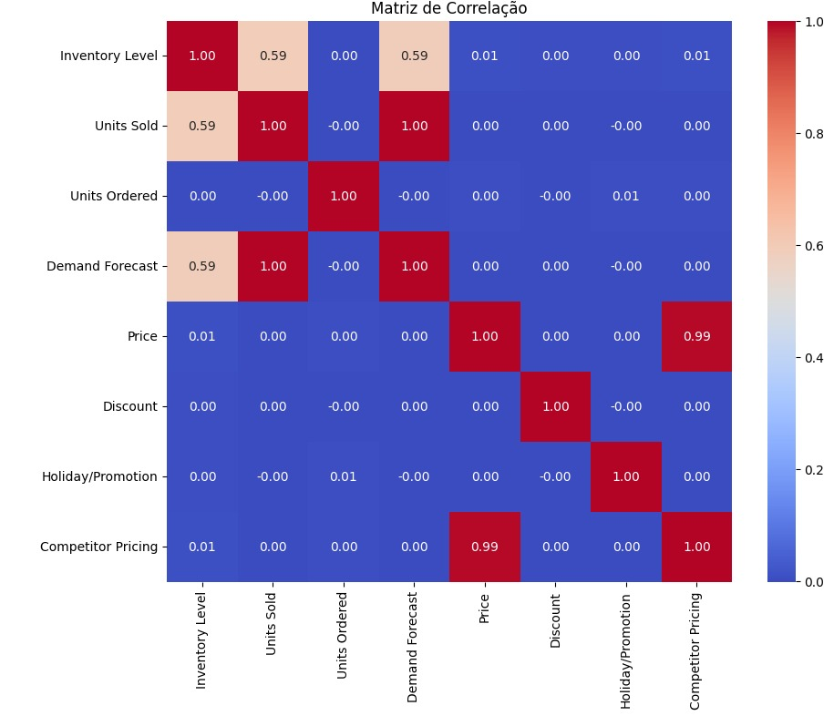
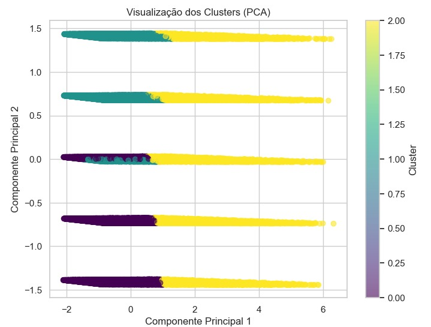
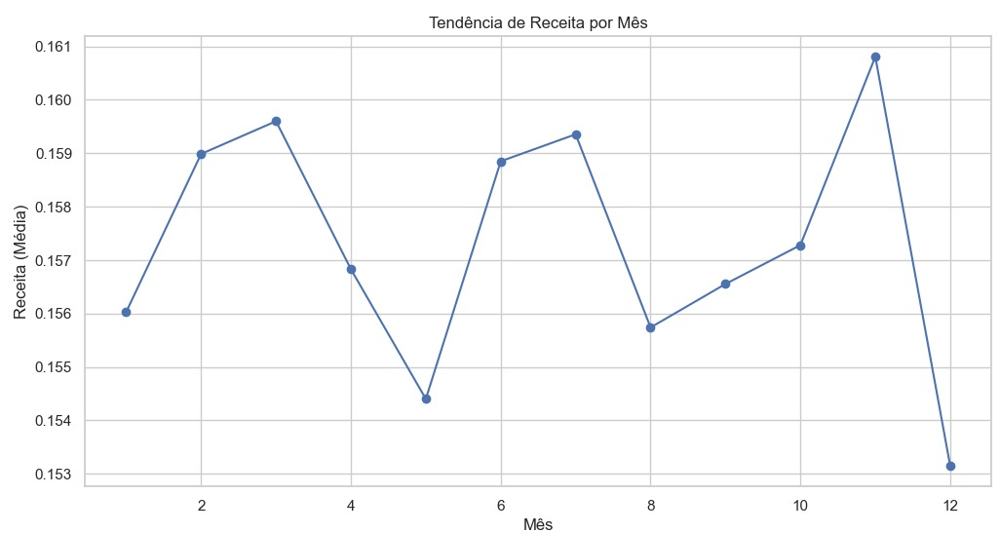

# **Análise e Modelagem de Dados: Previsão e Clusterização**

## **Introdução**
Este projeto utiliza a metodologia **CRISP-DM** para análise de dados de vendas e estoque, com o objetivo de:
- Identificar padrões de demanda.
- Otimizar estoques e logística.
- Analisar o impacto de fatores externos, como promoções, descontos e sazonalidade.

Utilizamos ferramentas avançadas para análise exploratória, modelagem preditiva e clusterização para fornecer insights práticos e recomendações acionáveis.

---

## **Metodologia**

### **Etapas do Projeto**
1. **Entendimento do Negócio**:
   - Objetivos principais:
     - Reduzir custos operacionais por meio de uma gestão eficiente de estoques.
     - Aumentar a precisão na previsão de vendas.
     - Identificar padrões sazonais e regionais.

2. **Entendimento dos Dados**:
   - Realizamos uma análise exploratória para compreender os dados, incluindo:
     - Estatísticas descritivas.
     - Análise de correlações e visualizações de dados categóricos e numéricos.

3. **Preparação dos Dados**:
   - Limpeza e tratamento de valores ausentes.
   - Transformação de variáveis categóricas em variáveis dummies.
   - Normalização de variáveis numéricas.

4. **Modelagem**:
   - **Modelos preditivos**:
     - Regressão Linear e Gradient Boosting para prever unidades vendidas.
   - **Clusterização**:
     - Uso de K-Means para identificar padrões entre produtos, regiões e categorias.

5. **Avaliação dos Resultados**:
   - Validação com métricas como MSE, R² e Silhouette Score.
   - Comparação dos resultados com os KPIs definidos no início do projeto.

6. **Implantação**:
   - Desenvolvimento de um pipeline automatizado para ingestão de dados, treinamento e geração de previsões.

---

## **Insights Principais**
### **1. Análise Qualitativa**
- As promoções não geraram impacto significativo nas vendas gerais, mas apresentaram bons resultados em categorias específicas.
- Certas regiões, como o norte e o sul, demonstraram sazonalidade mais evidente.

### **2. Análise Quantitativa**
- A correlação entre preço e unidades vendidas foi significativa, confirmando que descontos aumentam as vendas, mas com impacto limitado.
- Sazonalidade identificada em meses de pico, como janeiro e dezembro.

### **3. Clusterização**
- Foram identificados 3 clusters principais:
  - **Cluster 1**: Produtos de alta demanda com alta sazonalidade.
  - **Cluster 2**: Produtos com maior impacto de promoções.
  - **Cluster 3**: Produtos de demanda estável e pouca sensibilidade a preços.

---

## **Gráficos**

### **1. Matriz de Correlação**


### **2. Clusterização com PCA**


### **3. Tendência de Receita por Mês**


---

## **Insight Final**
O uso integrado de técnicas preditivas e clusterização proporcionou uma visão abrangente do comportamento de vendas, permitindo otimizações estratégicas:
- **Recomendações**:
  - Investir em promoções específicas para os produtos do Cluster 2.
  - Alocar estoques de forma sazonal para o Cluster 1.
  - Focar em estratégias de marketing e desconto em regiões mais sensíveis.

---

## **Pipeline Automatizado**
Um pipeline foi desenvolvido para automatizar o fluxo de ingestão, processamento, modelagem e geração de previsões. 

### **Como Usar o Pipeline**
1. Certifique-se de que os dados estão no arquivo `new_data.csv`.
2. Execute o pipeline com:
   ```bash
   python pipeline.py
